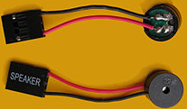
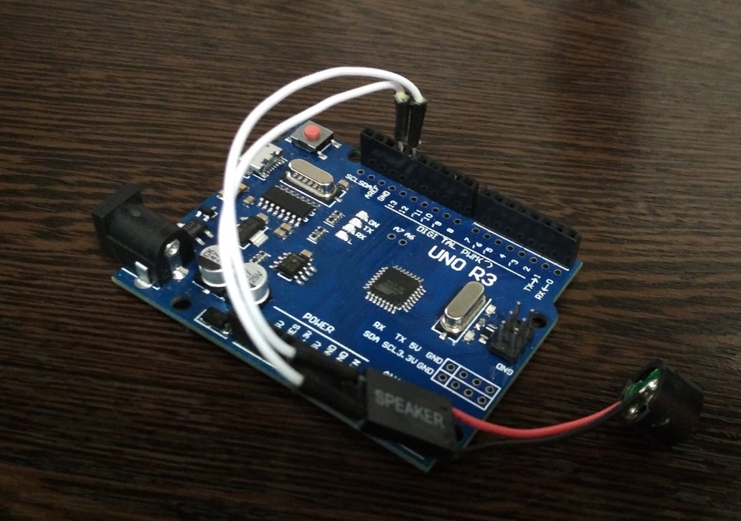
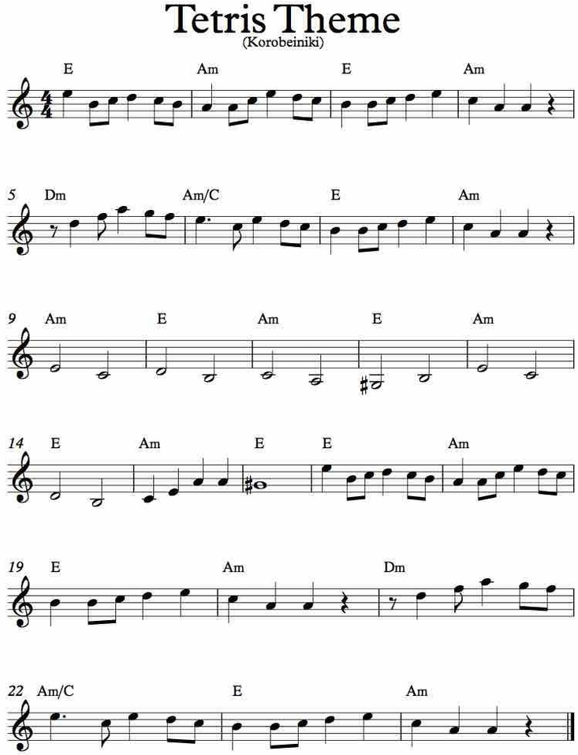

# Что это?

Arduino PC-speaker music without tone.

Это скетч для `arduino`, который играет какую-то музыку на "пищалке". В том числе и на `PC-speaker`.




Не используется модуль [`tone`](https://www.arduino.cc/reference/en/language/functions/advanced-io/tone/).

# Принцип работы

Пищалка состоит из кварцевого элемента. Как известно, если деформировать кварц, то будет напряжение. Это действует и наоборот, если приложить на кварц некое напряжение, то он деформируется. Если делать это с определённой частотой, то можно сказать ~~(но лучше так не говорить)~~, что он будет "колебаться". За один период как бы успеет 1 раз "включиться" и 1 раз "выключиться".

Звук - это волна. Волна колеблется с определённой частотой. Если "включать" и "выключать" пищалку с той же частотой, то будет получаться звук.

Например, пусть необходимо воспроизвести звук с частотой 540 Гц. Посчитаем период: 

T = 1/540 сек = 1.851 милисек = 1852 микросекунды

То есть за 1852 микросекунды нужно успеть "включить" и "выключить" пищалку.

``` cpp
...

unsigned T = 1852;
unsigned halfT = T / 2;

while(1)
{
    digitalWrite(pinOut, HIGH); // "Включить"

    delayMicroseconds(halfT); // Подождать полупериод

    digitalWrite(pinOut, LOW); // "Выключить"

    delayMicroseconds(halfT); // Подождать ещё полупериод
                            // И того пождали весь период
}
...
```

Ноты - это тоже звук. Частоту каждой ноты тоже можно узнать. Например, [тут](https://www.translatorscafe.com/unit-converter/ru-RU/calculator/note-frequency/).

# Сам скетч



В скетче `sketch.ino` "играется" мелодия из тетриса:



Причём не используется [`tone`](https://www.arduino.cc/reference/en/language/functions/advanced-io/tone/).